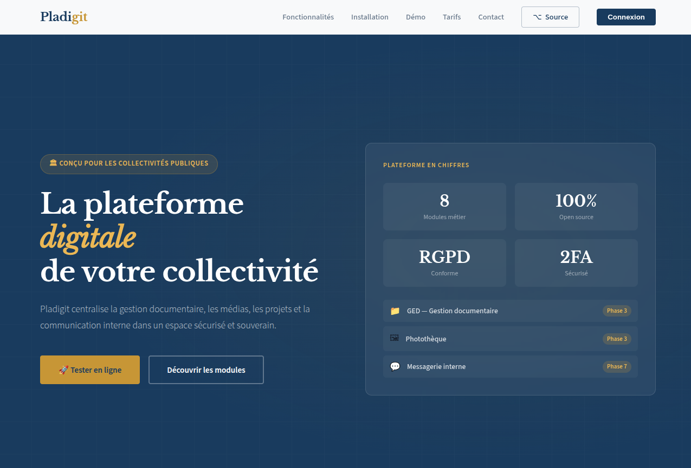
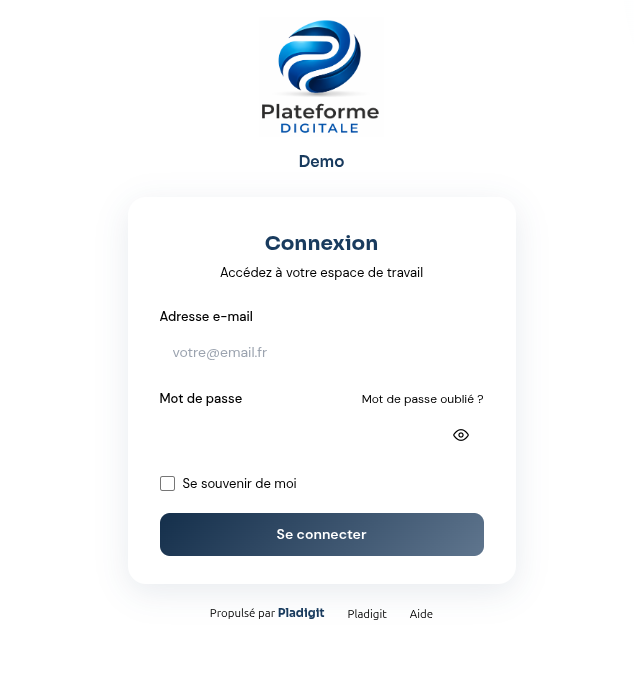
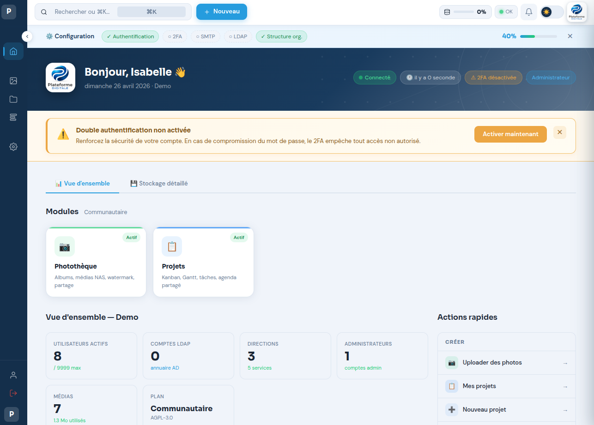
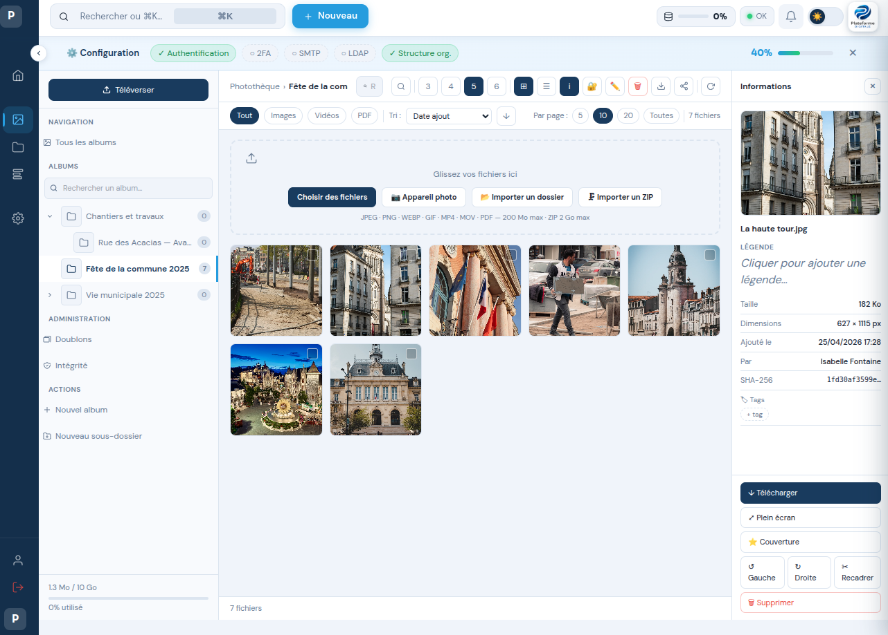
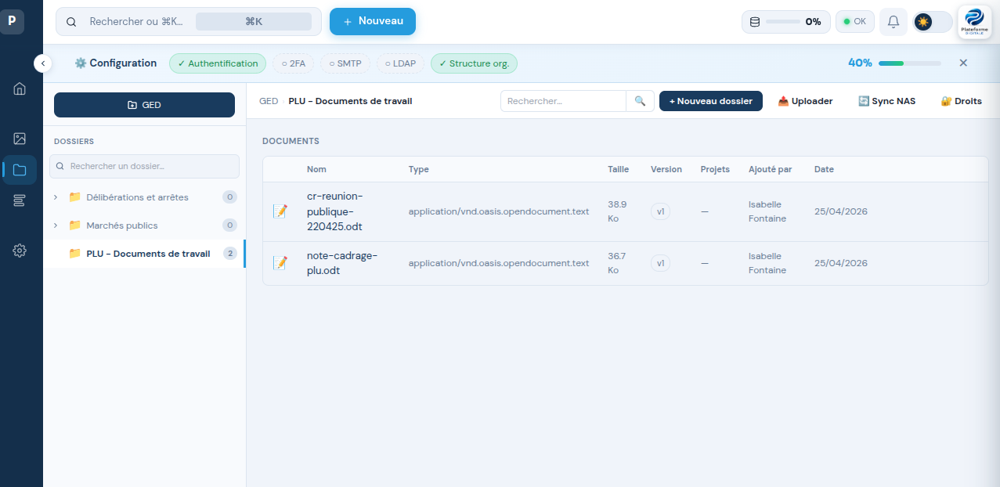
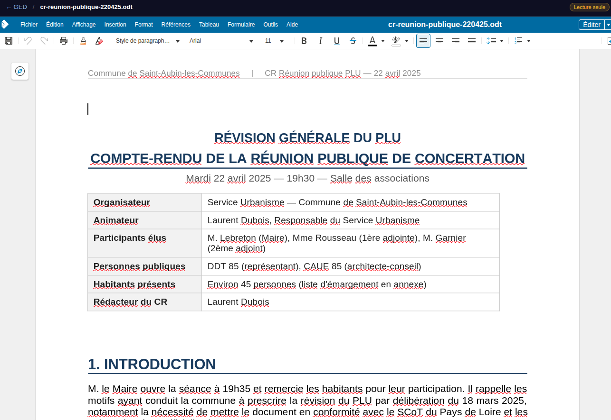
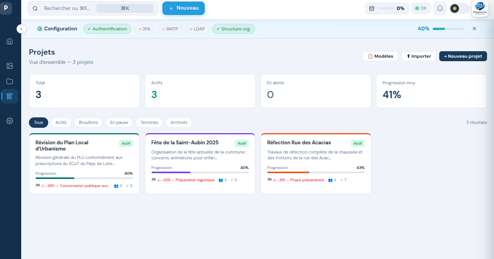
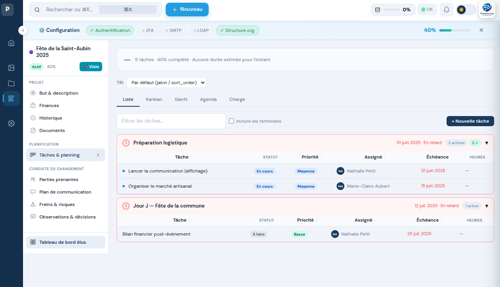
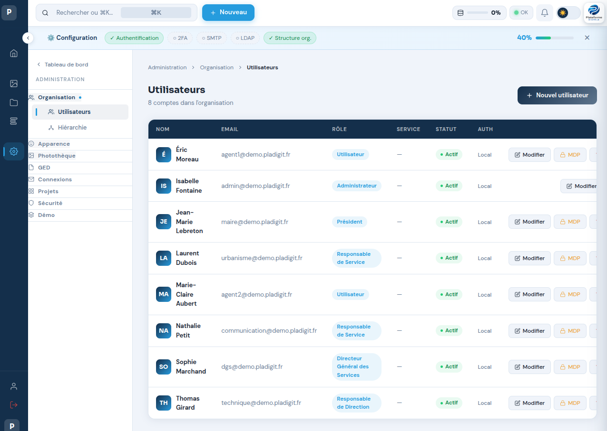

# Pladigit — Plateforme de Digitalisation Interne

> Alternative souveraine et open source aux outils Microsoft (Teams, SharePoint, OneDrive, Word, Excel, Planner)
> Conçue pour les collectivités locales, associations et structures du secteur parapublic français.


---

## Présentation

**Pladigit** est une plateforme multi-organisation destinée aux collectivités publiques et parapubliques françaises souhaitant reprendre le contrôle de leurs outils numériques.

Chaque organisation dispose d'un espace **isolé, sécurisé et personnalisé**, hébergé en France ou sur ses propres serveurs, sans aucune dépendance à un cloud propriétaire.

### Pourquoi Pladigit ?

- **Souveraineté numérique** — hébergement en France ou sur serveur interne, formats ouverts ODF, données hors portée des législations étrangères
- **Open source AGPL-3.0** — code auditable, pas de dépendance à un fournisseur unique, déployable sur vos serveurs
- **Conçu pour les collectivités françaises** — mairies, communautés de communes, associations, secteur parapublic, structure hiérarchique Direction > Service > Agent native
- **Zéro abonnement logiciel** — aucune licence Microsoft, aucun abonnement cloud

### Qui développe Pladigit ?

Pladigit est développé par **Jean-Pierre Bossé**, retraité de la fonction publique territoriale, basé à Soullans (Vendée). Ce projet est né d'une connaissance de terrain des besoins des petites collectivités et d'une conviction : un outil libre, bien conçu et installable en 30 minutes peut répondre aux besoins de 90 % des communes de moins de 20 000 habitants.

Contact : contact@pladigit.fr — GitHub : [@jpbosse](https://github.com/jpbosse)

---

## Remplacement des outils Microsoft

| Outil Microsoft | Alternative Pladigit | Statut |
|-----------------|---------------------|--------|
| Planner | Gestion de projet (Kanban, Gantt, Budget) | ✅ Livré |
| OneDrive / Photos | Photothèque NAS | ✅ Livré |
| SharePoint | GED documentaire + Collabora Online | ✅ Livré |
| Word / Excel / PowerPoint | Collabora Online (ODF natif) | ✅ Livré |
| Excel (listes et synthèses) | DataGrid + DataPilot | 🔜 Planifié |
| Teams | Messagerie instantanée | 🔜 Planifié |
| Outlook Calendrier | Agenda global + CalDAV | 🔜 Planifié |
| Forms | Sondages Pladigit | 🔜 Planifié |

---

## Fonctionnalités livrées

### Socle (Phases 1–2)
- Authentification locale sécurisée — bcrypt coût 12, verrouillage de compte, politique de mot de passe configurable
- Double authentification TOTP (Google Authenticator, Aegis, Authy) — codes de secours chiffrés AES-256
- Authentification LDAP / Active Directory — LDAPS obligatoire, circuit breaker, synchronisation automatique
- Architecture multi-organisation — base MySQL dédiée par organisation, isolation totale
- Gestion des rôles hiérarchiques — Admin, Président, DGS (Directeur Général des Services), SGM (Secrétaire Général de Mairie, loi du 30 décembre 2023), Responsable Direction, Responsable Service, Agent
- Structure organisationnelle — Directions > Services > Agents
- Journalisation complète — audit trail RGPD avec export CSV/JSON, rétention configurable de 12 mois (extensible à 36 mois)
- CI/CD GitHub Actions — PHPUnit, Pint PSR-12, PHPStan niveau 5, Composer audit

### Gestion de projet (Phase 3) — *remplace Microsoft Planner*
- Vues : Kanban par jalon, Gantt SVG avec drag & drop, Liste, Charge de travail, Agenda
- Tâches : récurrence, dépendances (Fin→Fin), commentaires, sous-tâches, assignation
- Budget : lignes investissement / fonctionnement / co-financement, graphiques, alertes dépassement
- Risques, observations, parties prenantes, conduite du changement
- Export PDF pour les élus, export iCal jalons, modèles de projet réutilisables, duplication
- Droits : UserRole global + ProjectRole par projet (ADR-010, ADR-011)
- Intégration visioconférence Jitsi Meet souverain (meet.numerique.gouv.fr)

### Photothèque NAS (Phases 4–5) — *remplace OneDrive Photos*
- Albums hiérarchiques, upload drag & drop, traitement asynchrone (file de tâches)
- Déduplication SHA-256 cross-album, extraction EXIF, filigrane configurable
- Partage par lien sécurisé temporaire, export ZIP, streaming HTTP adaptatif
- Synchronisation planifiée depuis NAS (local, SFTP, SMB)
- Droits par album, quotas de stockage stricts par organisation (alertes à 80/90/95 %)

### GED documentaire (Phase 6) — *remplace SharePoint*
- Arborescence de dossiers avec permissions fines (rôle, direction, service, utilisateur)
- Upload drag & drop, prévisualisation en ligne, versioning complet avec restauration
- Synchronisation NAS → GED (détection nouveaux fichiers, toutes les 5 minutes)
- Recherche plein texte (MySQL FULLTEXT — ADR-025)
- Gouvernance admin : transfert de propriété, purge, vérification d'intégrité
- Intégration GED ↔ Projets (ProjectGedLink)

### Collabora Online (Phase 7) — *remplace Microsoft Office*
- Édition collaborative des formats ODF (ODT, ODS, ODP) et Microsoft Office (DOCX, XLSX, PPTX)
- Protocole WOPI complet : CheckFileInfo, GetFile, PutFile, Lock/Unlock/RefreshLock/GetLock
- Token d'accès multi-organisation sécurisé — un seul aliasgroup Collabora pour tous les tenants
- Versioning automatique à chaque sauvegarde
- Administration : URL, durée de session, test de connexion depuis l'interface admin

---

## Captures d'écran



---



---



---



---



---



---



---



---



---

## Stack technique

| Technologie | Version | Rôle |
|-------------|---------|------|
| PHP | 8.4 | Langage backend |
| Laravel | 11.x | Framework MVC |
| Alpine.js | 3.x | Interactivité frontend |
| Livewire | 4.2 | Composants réactifs |
| MySQL | 8.0+ | Base de données multi-organisation |
| Redis | 7.x | Cache, files de tâches, sessions |
| Tailwind CSS | 3.x | Framework CSS |
| Collabora Online | CODE 24.x | Éditeur bureautique (protocole WOPI) |
| Docker | 24+ | Conteneurisation Collabora |
| PHPUnit | 11.x | Tests (759 tests / 1 645 assertions) |
| PHPStan | 1.x | Analyse statique niveau 5 |

---

## Installation

### Installation automatique (recommandée)

Une seule commande suffit. Elle installe PHP, MySQL, Redis, Nginx et Pladigit, puis ouvre un assistant de configuration dans votre navigateur.

**Prérequis :** Ubuntu 22.04 ou 24.04 LTS — 2 vCPU — 4 Go RAM — 25 Go SSD

```bash
curl -fsSL https://pladigit.fr/install.sh | sudo bash
```

L'assistant web vous guide ensuite en 8 étapes pour configurer la base de données, l'URL, l'email et le compte administrateur.

📖 [Guide d'installation illustré](https://htmlpreview.github.io/?https://github.com/jpbosse/pladigit/blob/main/docs/GUIDE-INSTALLATION.html) — avec captures d'écran pas-à-pas

### Installation manuelle (administrateurs expérimentés)

Pour les techniciens qui souhaitent contrôler chaque étape ou installer Pladigit sur un serveur existant :

📖 [INSTALL.md](INSTALL.md) — guide technique complet

### Téléchargement des fichiers d'installation

| Fichier | Description | Lien |
|---------|-------------|------|
| `install.sh` | Script bash d'installation automatique | [pladigit.fr/install.sh](https://pladigit.fr/install.sh) |
| `install/index.php` | Wizard web de configuration | [pladigit.fr/install-wizard.php](https://pladigit.fr/install-wizard.php) |

---

## Tests & qualité

```bash
php artisan test --exclude-group ldap,integration   # 759 tests
./vendor/bin/pint                                    # PSR-12
./vendor/bin/phpstan analyse --memory-limit=512M     # PHPStan niveau 5
composer audit                                       # 0 vulnérabilité
```

| Vérification | Résultat |
|-------------|----------|
| PHPUnit 11 | **759 tests / 1 645 assertions ✅** |
| Laravel Pint | PSR-12 ✅ |
| PHPStan niveau 5 | 0 erreur ✅ |
| Composer audit | 0 vulnérabilité ✅ |

---

## Documentation

### Documents racine

| Document | Description |
|----------|-------------|
| [INSTALL.md](INSTALL.md) | Guide technique complet — installation manuelle et production |
| [CONTRIBUTING.md](CONTRIBUTING.md) | Comment contribuer au projet |
| [SECURITY.md](SECURITY.md) | Signaler une vulnérabilité de sécurité |
| [CHANGELOG.md](CHANGELOG.md) | Historique des versions |
| [ROADMAP.md](ROADMAP.md) | Feuille de route détaillée |
| [CODE_OF_CONDUCT.md](CODE_OF_CONDUCT.md) | Code de conduite de la communauté |
| [ARGUMENTAIRE.md](ARGUMENTAIRE.md) | Argumentaires thématiques pour les collectivités et partenaires |
| [OBJECTIONS.md](OBJECTIONS.md) | Questions fréquentes et réponses honnêtes |

### Documentation technique (`docs/`)

| Document | Description |
|----------|-------------|
| [Guide d'installation illustré](https://htmlpreview.github.io/?https://github.com/jpbosse/pladigit/blob/main/docs/GUIDE-INSTALLATION.html) | Guide pas-à-pas avec captures d'écran |
| [docs/CDC_Pladigit_v2.3.md](docs/CDC_Pladigit_v2.3.md) | Cahier des charges complet |
| [docs/glossaire.md](docs/glossaire.md) | Glossaire des termes techniques et métier |
| [docs/adr/](docs/adr/) | Décisions architecturales — ADR-001 à ADR-031 |
| [docs/annexes/](docs/annexes/) | Documentation technique par module |
| [docs/guides/](docs/guides/) | Guides utilisateurs par profil |
| [docs/divers/checklist-mise-en-prod.md](docs/divers/checklist-mise-en-prod.md) | Checklist mise en production |
| [docs/divers/guide-maintenance.md](docs/divers/guide-maintenance.md) | Guide de maintenance |

### Guides utilisateurs

| Guide | Profil cible |
|-------|-------------|
| [guide-utilisateurs.md](docs/guides/guide-utilisateurs.md) | Tous les agents |
| [guide-admin-organisation.md](docs/guides/guide-admin-organisation.md) | Administrateurs organisation (SGM, DGS) |
| [guide-super-admin.md](docs/guides/guide-super-admin.md) | Super administrateur plateforme |
| [guide-utilisateur-gestion-projet.md](docs/guides/guide-utilisateur-gestion-projet.md) | Responsables de projet |
| [guide-utilisateur-phototheque.md](docs/guides/guide-utilisateur-phototheque.md) | Responsables photothèque |
| [guide-utilisateur-ged.md](docs/guides/guide-utilisateur-ged.md) | Utilisateurs GED et Collabora |

### Outils en ligne

| Outil | Description |
|-------|-------------|
| [calculateur-roi-pladigit.html](public/calculateur-roi-pladigit.html) | Calculateur ROI interactif — comparer le coût Pladigit vs Microsoft 365 |

---

## Roadmap

```
Oct 2025          Avr 2026               2027
│                 │                      │
├─ Ph.1 Socle ✅  ├─ Ph.6 GED ✅        ├─ DataGrid (listes sans code)
├─ Ph.2 Users ✅  ├─ Ph.7 Collabora ✅  ├─ DataPilot (tableaux croisés)
├─ Ph.3 Projets ✅├─ Ph.8 Wizard ✅     ├─ Messagerie instantanée
├─ Ph.4-5 Photo ✅│                      ├─ Agenda global + CalDAV
                  │                      ├─ Workflows documentaires
                  │                      ├─ Signature électronique
                  │                      └─ IA locale (Ollama — N3)
```

Voir [ROADMAP.md](ROADMAP.md) pour le détail complet.

---

## Instance de démonstration

Une instance est disponible sur **[pladigit.fr](https://pladigit.fr)** à titre de démonstration.

> ⚠ Cette instance tourne sur infrastructure personnelle. La disponibilité n'est pas garantie.
> Elle est réinitialisée périodiquement. Ne pas y déposer de données sensibles.

---

## Contribuer

Les contributions sont les bienvenues — code, documentation, traductions, retours d'usage terrain.

Voir [CONTRIBUTING.md](CONTRIBUTING.md) pour démarrer.

L'infrastructure de démonstration (VPS, domaine) est financée personnellement.
Si ce projet vous est utile, vous pouvez soutenir son développement via [GitHub Sponsors](https://github.com/sponsors/jpbosse).

---

## Licence

- **Code source** — [AGPL-3.0](LICENSE)
- **Documentation** — [CC BY-SA 4.0](https://creativecommons.org/licenses/by-sa/4.0/)

---

## Auteur

**Jean-Pierre Bossé** — Soullans (Vendée, France)
Retraité de la fonction publique territoriale

- GitHub : [@jpbosse](https://github.com/jpbosse)
- Email : contact@pladigit.fr
- Site : [pladigit.fr](https://pladigit.fr)

---

*Pladigit — Reprendre le contrôle de votre numérique.*
