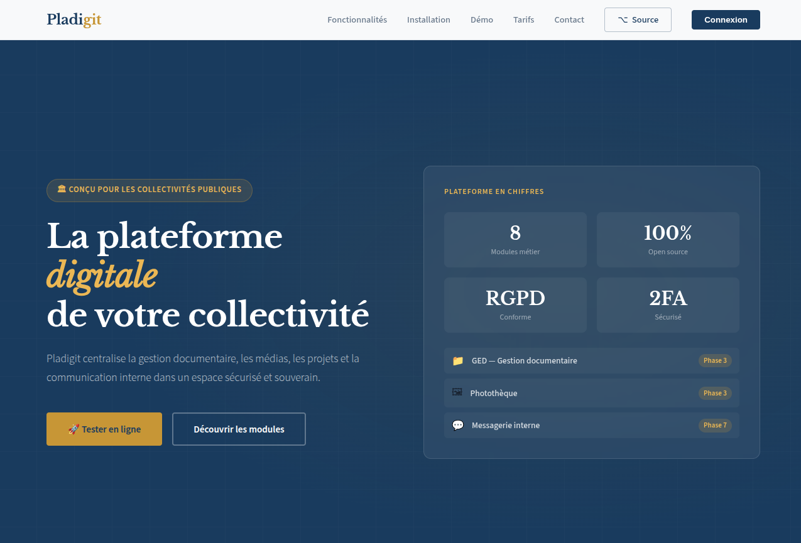
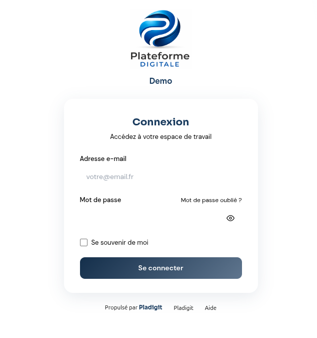
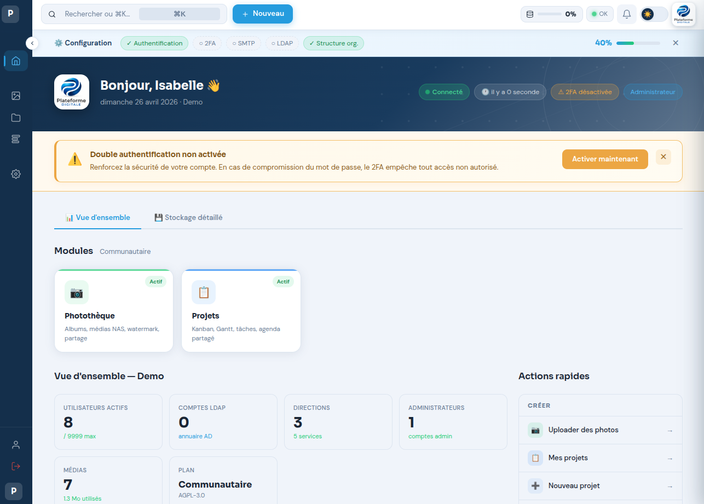
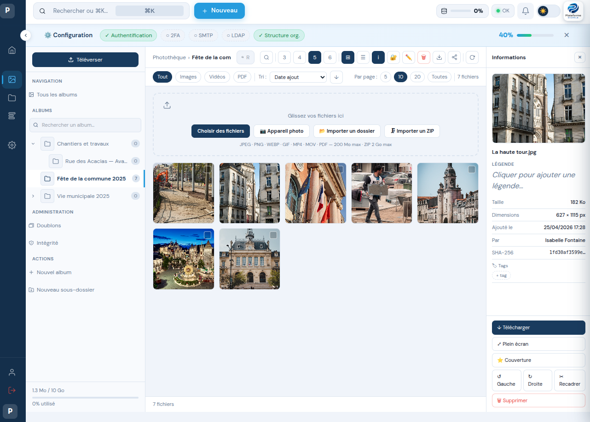
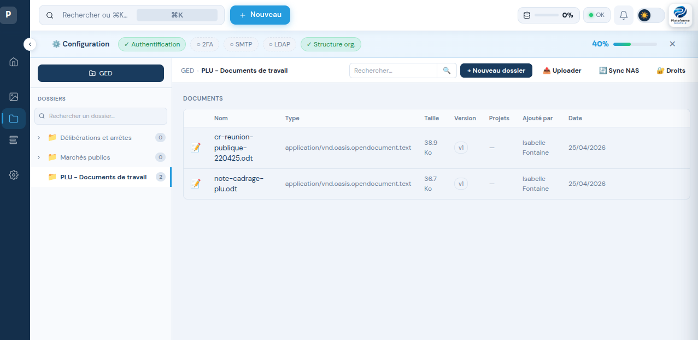
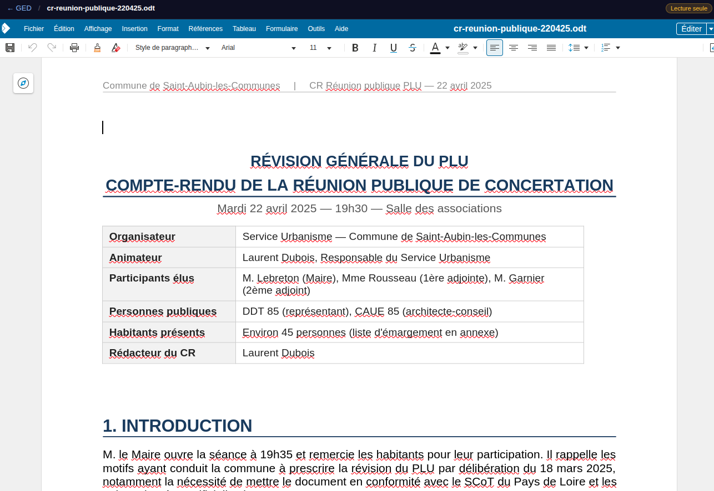
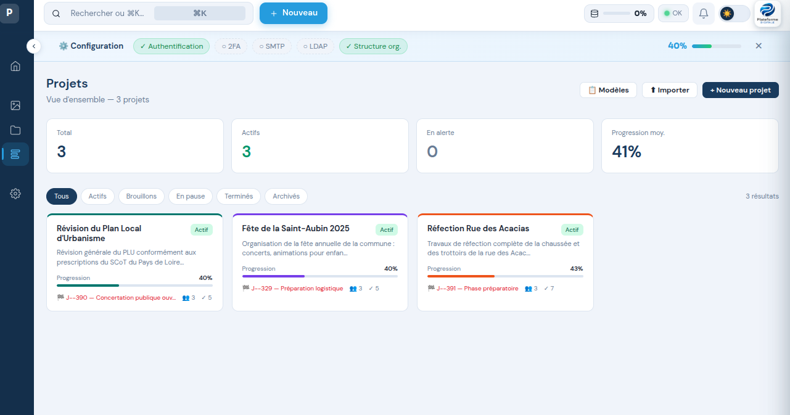
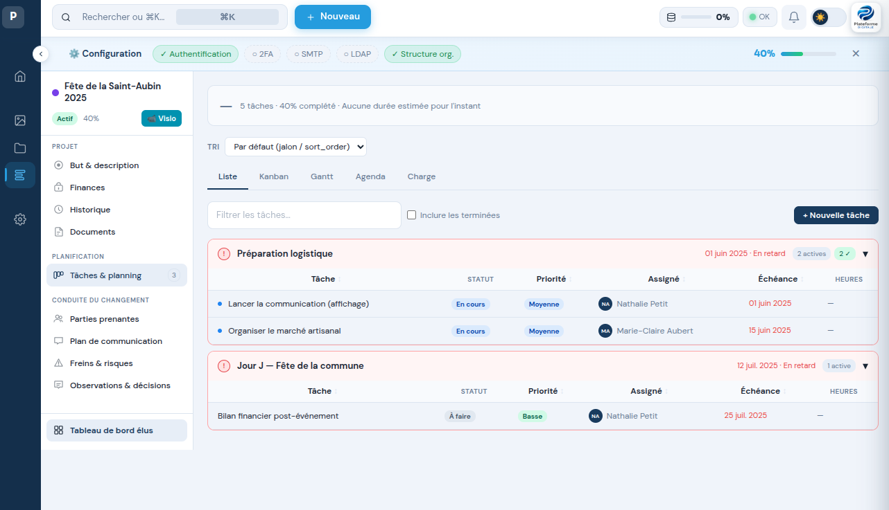
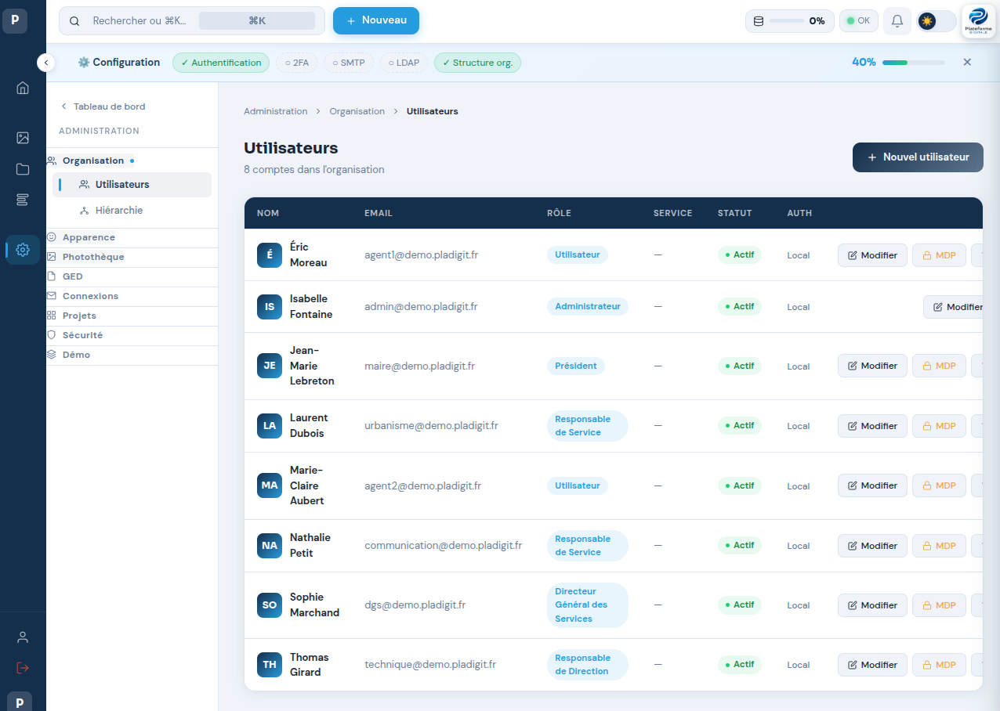

# Pladigit — Plateforme de Digitalisation Interne

> Alternative souveraine et open source aux outils Microsoft (Teams, SharePoint, OneDrive, Word, Excel, Planner)
> Conçue pour les collectivités locales, associations et structures du secteur parapublic français.


---

## Présentation

**Pladigit** est une plateforme multi-organisation destinée aux collectivités publiques et parapubliques françaises souhaitant reprendre le contrôle de leurs outils numériques.

Chaque organisation dispose d'un espace **isolé, sécurisé et personnalisé**, hébergé en France ou sur ses propres serveurs, sans aucune dépendance à un cloud propriétaire.

### Pourquoi Pladigit ?

- **Souveraineté numérique** — hébergement en France ou sur serveur interne, formats ouverts ODF, données hors portée des législations étrangères
- **Open source AGPL-3.0** — code auditable, pas de dépendance à un fournisseur unique, déployable sur vos serveurs
- **Conçu pour les collectivités françaises** — mairies, communautés de communes, associations, secteur parapublic, structure hiérarchique Direction > Service > Agent native
- **Zéro abonnement logiciel** — aucune licence Microsoft, aucun abonnement cloud

### Qui développe Pladigit ?

Pladigit est développé par **Jean-Pierre Bossé**, retraité de la fonction publique territoriale, basé à Soullans (Vendée). Ce projet est né d'une connaissance de terrain des besoins des petites collectivités et d'une conviction : un outil libre, bien conçu et installable en 30 minutes peut répondre aux besoins de 90 % des communes de moins de 20 000 habitants.

Contact : contact@pladigit.fr — GitHub : [@jpbosse](https://github.com/jpbosse)

---

## Remplacement des outils Microsoft

| Outil Microsoft | Alternative Pladigit | Statut |
|-----------------|---------------------|--------|
| Planner | Gestion de projet (Kanban, Gantt, Budget) | ✅ Livré |
| OneDrive / Photos | Photothèque NAS | ✅ Livré |
| SharePoint | GED documentaire + Collabora Online | ✅ Livré |
| Word / Excel / PowerPoint | Collabora Online (ODF natif) | ✅ Livré |
| Excel (listes et synthèses) | DataGrid + DataPilot | ✅ Livré (socle + niveau 2) |
| Teams | Messagerie instantanée | 🔜 Planifié |
| Outlook Calendrier | Agenda global + CalDAV | 🔜 Planifié |
| Forms | Sondages Pladigit | 🔜 Planifié |

---

## Fonctionnalités livrées

### Socle (Blocs 0–2)
- Authentification locale sécurisée — bcrypt coût 12, verrouillage de compte, politique de mot de passe configurable
- Double authentification TOTP (Google Authenticator, Aegis, Authy) — codes de secours chiffrés AES-256
- Authentification LDAP / Active Directory — LDAPS obligatoire, circuit breaker, synchronisation automatique
- Architecture multi-organisation — base MySQL dédiée par organisation, isolation totale
- Gestion des rôles hiérarchiques — Admin, Président, DGS, SGM, Responsable Direction, Responsable Service, Agent
- Structure organisationnelle — Directions > Services > Agents
- Journalisation complète — audit trail RGPD avec export CSV/JSON, rétention configurable
- CI/CD GitHub Actions — PHPUnit, Pint PSR-12, PHPStan niveau 9, Composer audit
- Ressources statiques rapatriées en local — zéro requête CDN tiers, souveraineté complète
- En-têtes HTTP de sécurité — CSP, HSTS, X-Frame-Options DENY, Referrer-Policy, Permissions-Policy
- Mise à jour depuis le Super Admin — sans accès SSH
- **Sauvegardes automatiques chiffrées GPG** — archives par organisation, vérification SHA-256, planification nocturne

### Gestion de projet (Bloc 3) — *remplace Microsoft Planner*
- Vues : Kanban par jalon, Gantt SVG avec drag & drop, Liste, Charge de travail, Agenda
- Tâches : récurrence, dépendances, commentaires, assignation
- Budget : lignes investissement / fonctionnement / co-financement, graphiques, alertes dépassement
- Risques, observations, parties prenantes, conduite du changement
- Export PDF pour les élus, export iCal jalons, modèles de projet réutilisables
- Intégration visioconférence Jitsi Meet souverain

### Photothèque NAS — *remplace OneDrive Photos*
- Albums hiérarchiques, upload drag & drop, traitement asynchrone
- Déduplication SHA-256, extraction EXIF, filigrane configurable
- Partage par lien sécurisé temporaire, export ZIP, streaming HTTP adaptatif
- Synchronisation planifiée depuis NAS (local, SFTP, SMB)
- Droits par album, quotas de stockage stricts par organisation

### GED documentaire — *remplace SharePoint*
- Arborescence de dossiers avec permissions fines (rôle, direction, service, utilisateur)
- Upload drag & drop, prévisualisation en ligne, versioning complet avec restauration
- Synchronisation NAS → GED, recherche plein texte MySQL FULLTEXT
- Intégration GED ↔ Projets

### Collabora Online — *remplace Microsoft Office*
- Édition collaborative des formats ODF et Microsoft Office (DOCX, XLSX, PPTX)
- Protocole WOPI complet, versioning automatique à chaque sauvegarde
- Token d'accès multi-organisation sécurisé

### DataGrid + DataPilot — *remplace les tableurs Excel éparpillés*
- Import CSV / XLSX / ODS avec détection automatique, typage des colonnes
- Droits hiérarchiques par rôle, département et utilisateur — colonnes masquables par service
- Organisation en dossiers, recherche globale multi-colonnes, vues sauvegardées
- Export Excel, ODS et PDF avec filtres actifs
- Audit log complet

---

## Captures d'écran



---



---



---



---



---



---



---



---



---

## Stack technique

| Technologie | Version | Rôle |
|-------------|---------|------|
| PHP | 8.4+ | Langage backend |
| Laravel | 12.x | Framework MVC |
| Alpine.js | 3.x | Interactivité frontend |
| Livewire | 4.x | Composants réactifs |
| MySQL | 8.0+ | Base de données multi-organisation |
| Redis | 7.x | Cache, files de tâches, sessions |
| Tailwind CSS | 3.x | Framework CSS |
| Collabora Online | CODE 24.x | Éditeur bureautique (protocole WOPI) |
| Docker | 24+ | Conteneurisation Collabora |
| PHPUnit | 11.x | Tests (886 tests / 1 800+ assertions) |
| PHPStan | 1.x | Analyse statique niveau 9 |

---

## Installation

### Installation automatique (recommandée)

Une seule commande suffit. Elle installe PHP, MySQL, Redis, Nginx et Pladigit, puis ouvre un assistant de configuration dans votre navigateur.

**Prérequis :** Ubuntu 24.04 LTS — 2 vCPU — 4 Go RAM — 25 Go SSD

```bash
curl -fsSL https://pladigit.fr/install.sh | sudo bash
```

L'assistant web vous guide ensuite en quelques étapes pour configurer l'URL, l'email, le chiffrement GPG des sauvegardes et le compte Super Administrateur.

📖 [Guide d'installation illustré](https://htmlpreview.github.io/?https://github.com/jpbosse/pladigit/blob/main/docs/GUIDE-INSTALLATION.html) — avec captures d'écran pas-à-pas

### Installation manuelle (administrateurs expérimentés)

📖 [INSTALL.md](INSTALL.md) — guide technique complet

---

## Tests & qualité

```bash
php -d memory_limit=512M vendor/bin/phpunit   # 886 tests
./vendor/bin/pint                              # PSR-12
./vendor/bin/phpstan analyse --memory-limit=512M  # PHPStan niveau 9
composer audit                                 # 0 vulnérabilité
```

| Vérification | Résultat |
|-------------|----------|
| PHPUnit | **886 tests ✅** |
| Laravel Pint | PSR-12 ✅ |
| PHPStan niveau 9 | 0 erreur ✅ |
| Composer audit | 0 vulnérabilité ✅ |

---

## Documentation

### Documents racine

| Document | Description |
|----------|-------------|
| [INSTALL.md](INSTALL.md) | Guide technique complet — installation manuelle et production |
| [CONTRIBUTING.md](CONTRIBUTING.md) | Comment contribuer au projet |
| [SECURITY.md](SECURITY.md) | Signaler une vulnérabilité de sécurité |
| [CHANGELOG.md](CHANGELOG.md) | Historique des versions |
| [ROADMAP.md](ROADMAP.md) | Feuille de route détaillée |
| [CODE_OF_CONDUCT.md](CODE_OF_CONDUCT.md) | Code de conduite de la communauté |
| [ARGUMENTAIRE.md](ARGUMENTAIRE.md) | Argumentaires thématiques pour les collectivités et partenaires |
| [OBJECTIONS.md](OBJECTIONS.md) | Questions fréquentes et réponses honnêtes |

### Documentation technique (`docs/`)

| Document | Description |
|----------|-------------|
| [Guide d'installation illustré](https://htmlpreview.github.io/?https://github.com/jpbosse/pladigit/blob/main/docs/GUIDE-INSTALLATION.html) | Guide pas-à-pas avec captures d'écran |
| [docs/01-product/CDC_Pladigit_v2.4.md](docs/01-product/CDC_Pladigit_v2.4.md) | Cahier des charges complet |
| [docs/glossaire.md](docs/glossaire.md) | Glossaire des termes techniques et métier |
| [docs/04-adr/](docs/04-adr/) | Décisions architecturales — ADR-001 à ADR-043 |
| [docs/02-architecture/annexes/](docs/02-architecture/annexes/) | Documentation technique par module |
| [docs/03-guides/](docs/03-guides/) | Guides utilisateurs par profil |

### Guides utilisateurs

| Guide | Profil cible |
|-------|-------------|
| [guide-utilisateurs.md](docs/03-guides/guide-utilisateurs.md) | Tous les agents |
| [guide-admin-organisation.md](docs/03-guides/guide-admin-organisation.md) | Administrateurs organisation |
| [guide-super-admin.md](docs/03-guides/guide-super-admin.md) | Super administrateur plateforme |
| [guide-utilisateur-gestion-projet.md](docs/03-guides/guide-utilisateur-gestion-projet.md) | Responsables de projet |
| [guide-utilisateur-phototheque.md](docs/03-guides/guide-utilisateur-phototheque.md) | Utilisateurs photothèque |
| [guide-utilisateur-ged.md](docs/03-guides/guide-utilisateur-ged.md) | Utilisateurs GED et Collabora |
| [guide-utilisateur-datagrid.md](docs/03-guides/guide-utilisateur-datagrid.md) | Utilisateurs DataGrid |

---

## Roadmap

```
Oct 2025          Juin 2026              2027
│                 │                      │
├─ Socle ✅       ├─ Sécurité ✅        ├─ Messagerie instantanée
├─ Projets ✅     ├─ Sauvegardes GPG ✅ ├─ Agenda global + CalDAV
├─ Photothèque ✅ ├─ DataGrid ✅        ├─ Signature électronique
├─ GED ✅         ├─ Laravel 12 ✅      ├─ IA locale (Ollama)
├─ Collabora ✅   │                      └─ API REST publique
└─ Installeur ✅  │
```

Voir [ROADMAP.md](ROADMAP.md) pour le détail complet.

---

## Instance de démonstration

Une instance est disponible sur **[demo.pladigit.fr](https://demo.pladigit.fr)** à titre de démonstration.

> ⚠ Cette instance tourne sur infrastructure personnelle. La disponibilité n'est pas garantie.
> Elle est réinitialisée périodiquement. Ne pas y déposer de données sensibles.

---

## Contribuer

Les contributions sont les bienvenues — code, documentation, traductions, retours d'usage terrain.

Voir [CONTRIBUTING.md](CONTRIBUTING.md) pour démarrer.

L'infrastructure de démonstration (VPS, domaine) est financée personnellement.
Si ce projet vous est utile, vous pouvez soutenir son développement via [GitHub Sponsors](https://github.com/sponsors/jpbosse).

---

## Licence

- **Code source** — [AGPL-3.0](LICENSE)
- **Documentation** — [CC BY-SA 4.0](https://creativecommons.org/licenses/by-sa/4.0/)

---

## Auteur

**Jean-Pierre Bossé** — Soullans (Vendée, France)
Retraité de la fonction publique territoriale

- GitHub : [@jpbosse](https://github.com/jpbosse)
- Email : contact@pladigit.fr
- Site : [pladigit.fr](https://pladigit.fr)

---

*Pladigit — Reprendre le contrôle de votre numérique.*
